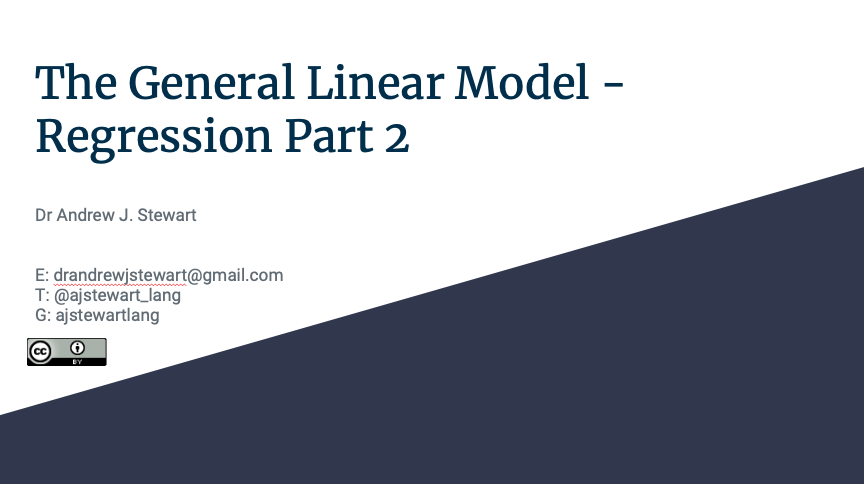

# Overview

First off I'd like you to watch the following video which builds on the first regression workshop. We explore how to build regression models with more than one predictor in R using the `lm()` function, test our model assumptions, and interpret the output. We look at different ways of building stepwise regression models with multiple predictors, before finishing by looking at mediation and moderation. 

&nbsp;&nbsp;

<center>

[Link to YouTube video here]

</center>

## Slides

If you have a Google account, you can also view and download the slides in a range of formats by clicking on the image below. If you don't have a Google account, you can download the slides in .pdf format by [clicking here](../slides/glm_pt2.pdf).

&nbsp;&nbsp;

<center>

[{width=75%}](https://docs.google.com/presentation/d/1YAdXxIr3Hk7Ql7GHUZFmBsVXd6X-k_L-nmOLhQnjqMM/edit?usp=sharing)

</center>

&nbsp;&nbsp;

[Link to live coding video]

# Multiple Regression 

In standard multiple regression all the independent variables (IVs) are entered into the equation and evaluated for their contribution at the same time. Let’s work through a specific example.

An educational psychologist conducted a study that investigated the psycholinguistic variables that contribute to spelling performance in primary school children aged between 7- and 9-years. The researcher presented children with 48 words that varied systematically according to certain features such as age of acquisition, word frequency, word length, and imageability. The psychologist wants to check whether performance on the test accurately reflected children’s spelling ability as estimated by a standardised spelling test. That is, the psychologist wants to check whether her test was appropriate.

Children’s chronological age (in months) (age), their reading age (RA), their standardised reading age (std_RA), and their standardised spelling score (std_SPELL) were chosen as predictor variables. The criterion variable (Y) was the percentage correct spelling (corr_spell) score attained by each child using the list of 48 words. 

First we need to load the packages we need - the require function assumes they are already on your machine.  If they are not, then you need to install.packages ("packagename") first:

## The Packages We Need

```{r, message=FALSE}
library(tidyverse) # Load the tidyverse packages
library(Hmisc) # Needed for correlation
library(MASS) # Needed for maths functions
library(car) # Needed for VIF calculation
library(olsrr) # Needed for stepwise regression 
library(performance) # Needed to check model assumptions
```

## Import the Data

You now need to read in the data file.

```{r, message=FALSE}
MRes_tut2 <- read_csv("https://raw.githubusercontent.com/ajstewartlang/10_glm_regression_pt2/master/data/MRes_tut2.csv")
```

### Examining Possible Relationships

Before we start, let's look at the relationships between our IVs (predictors) and our DV (outcome).  We can plot graphs depicting the correlations.  We'll plot test performance against each of our four predictors in turn:

```{r, message=FALSE}
ggplot(MRes_tut2, aes(x = age, y = corr_spell)) + 
  geom_point() + 
  geom_smooth(method = "lm", se = FALSE) +
  theme_minimal() +
  theme(text = element_text(size = 13)) 

ggplot(MRes_tut2, aes(x = RA, y = corr_spell)) + 
  geom_point() + 
  geom_smooth(method = "lm", se = FALSE) +
  theme_minimal() +
  theme(text = element_text(size = 13)) 

ggplot(MRes_tut2, aes(x = std_RA, y = corr_spell)) + 
  geom_point() + 
  geom_smooth(method = "lm", se = FALSE) +
  theme_minimal() +
  theme(text = element_text(size = 13)) 

ggplot(MRes_tut2, aes(x = std_SPELL, y = corr_spell)) + 
  geom_point() + 
  geom_smooth(method = "lm", se = FALSE) +
  theme_minimal() +
  theme(text = element_text(size = 13)) 
```

## Model the Data

We are going to do hierarchical regression first - we'll build one model (which we'll call `model0`) that is the mean of our outcome variable, and another model (`model1`) which contains all our predictors:

```{r}
model0 <- lm(corr_spell ~ 1, data = MRes_tut2)
model1 <- lm(corr_spell ~ age + RA + std_RA + std_SPELL, data = MRes_tut2)
```

Let's compare them to each other:

```{r}
anova(model0, model1)
```

We see that the models differ from each other (look a the *p*-value of the comparison) and that the model with the four predictors has the lower Residuals (RSS) value meaning there is less error between the model and the observed data relative to the simpler intercept-only model (i.e., the mean) and the observed data.

### Checking our Assumptions

OK, so they differ - now let's plot information about our model assumptions - remember, we are particularly interested in Cook's distance values for our case...

```{r, warning=FALSE, message=FALSE}
check_model(model1)
```

The errors looks fairly equally distributed along our fitted values (homoscedasticity) - although a little worse for high fitted values - and from the Q-Q plot we can tell they look fairly normal (they should follow the diagonal).  How about influential cases?  So, Case 10 looks a bit dodgy - it has a high Cook's Distance value - which suggests it is having a disproportionate effect on our model.  Let's exclude it using the `filter()` function - the symbol `!=` means 'does not equal' so we are selecting values other than Case 10.  

### Dropping an Influential Case

```{r}
MRes_tut2_drop10 <- filter(MRes_tut2, case != "10")
```

### Re(model) the Data

We now create another model (`model2`) which doesn't include Case 10.

```{r}
model2 <- lm(corr_spell ~ age + RA + std_RA + std_SPELL, data = MRes_tut2_drop10)
```

Let's check the model assumptions again using `check_model()`.

### Checking our Assumptions

```{r, warning=FALSE, message=FALSE}
check_model(model2)
```

Now, let's look at the multicollinearity values measured by VIF:

```{r}
vif(model2)
```

It looks like RA and std_RA are problematic.  We can look at the correlation between them using the `rcorr()` function:

```{r}
rcorr(MRes_tut2_drop10$RA, MRes_tut2_drop10$std_RA)
```

### Re(model) the Data

The correlation is pretty high (0.88), so let's exclude the predictor with the highest VIF value (which is RA) and build a new model:

```{r}
model3 <- lm(corr_spell ~ age + std_RA + std_SPELL, data = MRes_tut2_drop10)
vif(model3)
```

### Checking our Assumptions

These values look ok now. Let's check the model assumptions again.

```{r, warning=FALSE, message=FALSE}
check_model(model3)
```

### Summary of our Model

Now let's generate the coefficients as this looks like a sensible model.

```{r}
summary(model3)
model0 <- lm(corr_spell ~ 1, data = MRes_tut2_drop10)
anova(model3, model0)
```

We'd write our equation as something like:

`Spelled correct = -209.44 + 1.10(age) + 0.38(std_RA) + 1.21(std_SPELL) + residual`

# Stepwise regression

We can also do stepwise regression - forwards is when you start with the null model and predictors are added until they don't explain any more variance, backwards is when you start with the full model and remove predictors until removal starts affecting your model's predictive ability. Let's keep case 10 dropped and also drop the high VIF predictor (RA). This is handy for models with lots of predictors where the order in sequential regression is not obvious. 

## Model the Data

```{r}
model0 <- lm(corr_spell ~ 1, data = MRes_tut2_drop10)
model1 <- lm(corr_spell ~ age + std_RA + std_SPELL, data = MRes_tut2_drop10)
```

Let's do stepwise forwards:

```{r}
steplimitsf <- step(model0, scope = list (lower = model0, upper = model1), direction = "forward")
summary(steplimitsf)
```

Stepwise backwards:

```{r}
steplimitsb <- step(model1, direction = "back")
summary(steplimitsb)
```

And stepwise using both forwards and backwards procedures:

```{r}
steplimitsboth <- step(model0, scope = list (upper = model1), direction = "both")
```

### Checking our Assumptions

```{r, warning=FALSE, message=FALSE}
check_model(steplimitsboth)
```

These look ok.

```{r}
summary(steplimitsboth)
```

You'll see that the same final model is arrived it in each case. We have three significant predictors.

### Minimising our *p*-value

We can also use the `ols_step_forward_p()` function from the package `olsrr` - this works by finding the best model by entering the predictors based on their *p* values.  There are other methods within the `olsrr` package.  To see them, type `olsrr::` into the console window.

```{r}
pmodel <- ols_step_forward_p(model1)
pmodel
```

In this case, the model with the lowest AIC value is also the one arrived at statistically via the sequential procedure based on *p*-values - but this may not always be the case.

## Improve this Workshop

If you spot any issues/errors in this workshop, you can raise an issue or create a pull request for [this repo](https://github.com/ajstewartlang/09_glm_regression_pt1). 

